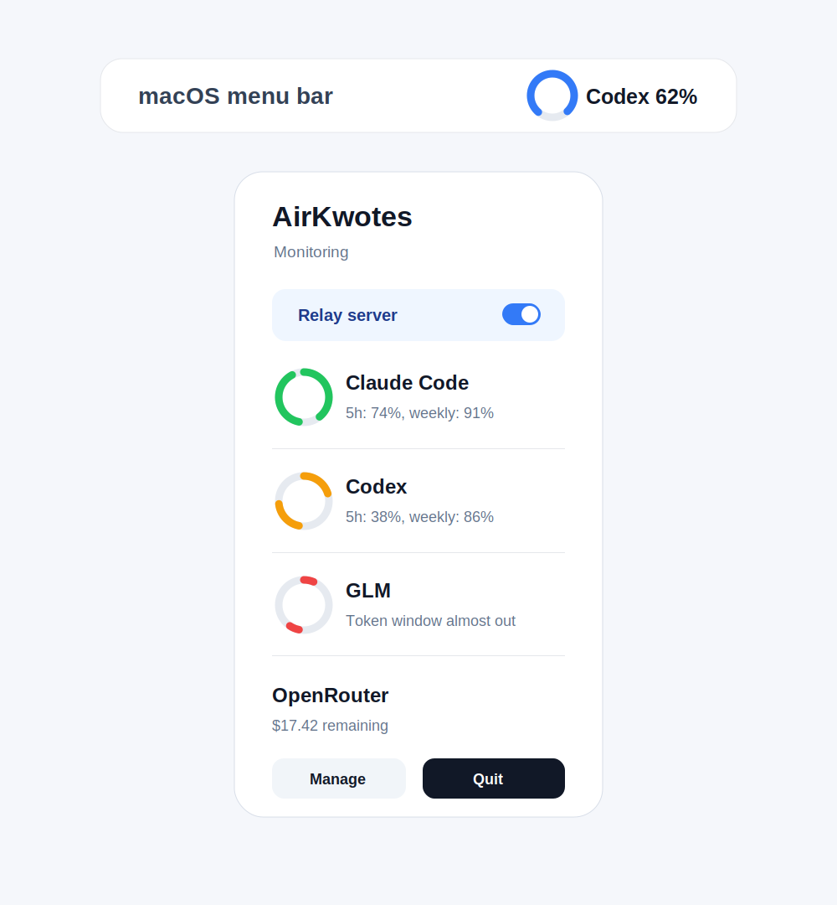

# AirKwotes

AirKwotes is a macOS menu-bar app for people who use several AI tools and want
one simple answer: **how much quota do I have left?**

It shows a small **ring** in the menu bar for your chosen provider. Click it to
see every connected provider, open the setup window, or turn on the optional
local relay for tools that speak OpenAI/Gemini-compatible APIs.



## Install for Mac

### Easiest: download the app

1. Open the [Releases page](https://github.com/funkchi/AirKwotes/releases).
2. Download `AirKwotes-0.1.0.dmg`.
3. Open the `.dmg` and drag **AirKwotes** into **Applications**.
4. First launch only: right-click **AirKwotes** -> **Open** -> **Open**.
5. Click the menu-bar ring -> **Manage** -> **Providers** to add Claude Code,
   Codex, Gemini, GLM, OpenRouter, or API-key providers.

For a slower, screenshot-style walkthrough, see
[`docs/install.md`](docs/install.md).

### Comfortable with Terminal?

```sh
brew tap funkchi/airkwotes
brew install --cask airkwotes
```

Or build from source:

```sh
git clone https://github.com/funkchi/AirKwotes.git
cd AirKwotes
make cert
make run
```

## What It Looks Like

### Menu-bar ring

The menu-bar icon is a quota ring. Green means plenty left, orange means getting
low, and red means close to the limit.

### Provider setup

Claude Code, Codex, and Gemini can work without pasting an API key because
AirKwotes reads local logins, logs, or rate-limit signals those tools already
store on your Mac. Other providers use API keys saved in the macOS Keychain.

### Local relay

The Relay tab can expose signed-in subscriptions on `127.0.0.1` for local tools.
It is optional, off by default, and protected by a local `sk-...` key.

> ⚠️ **Terms-of-service notice.** AirKwotes reads rate-limit logs and, for the
> relay, forwards requests to upstream subscriptions (OpenAI Codex, Google
> Gemini Code Assist) using credentials those CLIs already store. This may
> violate the terms of Anthropic, OpenAI, and/or Google. Use it only for
> personal, research, and interoperability purposes, and review each provider's
> agreement yourself. All risk is yours; the author takes no responsibility for
> account bans, service interruption, or any other consequence.

---

## What It Tracks

### Quota providers
| Provider | How it's read | Notes |
| --- | --- | --- |
| **Claude Code** | OAuth token from Claude Code's Keychain item / `~/.claude` → Anthropic API rate-limit headers (5h + 7d windows). Falls back to statusline/log snapshots. | Zero-config, keyless |
| **Codex** | `~/.codex/sessions/**/*.jsonl` `rate_limits` (5h + weekly) | Zero-config, keyless |
| **DeepSeek** | `GET /user/balance` | API key |
| **Kimi (Moonshot)** | `GET /v1/users/me/balance` | API key |
| **GLM (Zhipu / Z.ai)** | `/api/monitor/usage/quota/limit` (5h token window + monthly MCP) | Anthropic-auth-token |
| **OpenRouter** | `GET /api/v1/key` (spend limit + usage) | API key |
| **SiliconFlow** | `GET /v1/user/info` (balance + total) | API key |
| OpenAI, Gemini (key), Qwen, Anthropic (key), Mistral, xAI | Key validation only | No public quota API |

### Relay (subscription → local API)
| Upstream | Local endpoint | Status |
| --- | --- | --- |
| **Codex (ChatGPT)** | `http://127.0.0.1:8787/v1/...` | OAuth + models; forwarding in progress |
| **Gemini (Code Assist)** | `http://127.0.0.1:8787/v1beta/...` | Forwards to `cloudcode-pa.googleapis.com` (needs the account onboarded) |

The relay is **loopback-only** and authenticated by a local `sk-…` key you copy
from the Relay tab.

---

## Using it

1. The menu-bar ring shows one provider. Click it for the dropdown of all.
2. Open **Manage** (or the setup window) → **Providers** tab → **+** to add a
   provider and paste its key (stored in Keychain). For Claude Code / Codex /
   Gemini CLI users, no key is needed — the local reader works automatically.
3. **Settings** tab: polling interval, launch-at-login, low-quota
   notifications + threshold, menu-bar appearance.
4. **Relay** tab: sign in with ChatGPT and/or Google (or reuse an existing
   Codex/Gemini CLI login), toggle the server, then point your tools at
   `http://127.0.0.1:8787/v1` (OpenAI-style) or `/v1beta` (Gemini-style).

---

## Architecture

- **SwiftUI** menu-bar app (`LSUIElement`, no Dock icon), built with a
  zero-dependency `Makefile` (`swiftc` → `.app`). `project.yml` is included for
  [xcodegen](https://github.com/yonaskolb/XcodeGen) users (`make xcode`).
- `Sources/Providers/` — one `QuotaProvider` per upstream; keyless local
  readers (Claude/Codex) parse JSONL rate-limit logs or live API headers.
- `Sources/Relay/` — `LoopbackHTTPServer` (Network.framework) +
  `RelayServer` (routes) + per-upstream OAuth clients and forwarders.
- `Sources/State/` — `AppState` (providers, snapshots, polling, reminders),
  `RelayManager` (OAuth + server lifecycle), `KeychainStore` (all secrets).

See [`docs/providers.md`](docs/providers.md) and [`docs/relay.md`](docs/relay.md).

---

## Releasing (maintainers)

One command cuts a GitHub Release with a `.dmg`:
```sh
scripts/release.sh 0.2.0
```
This bumps `Info.plist`, tags `v0.2.0`, builds + packages the dmg, computes its
sha256, updates the Homebrew cask, and uploads the asset via `gh`.

Releases are currently **unsigned**. With an Apple Developer ID:
```sh
make release SIGN_IDENTITY="Developer ID Application: funkchi"
make notarize   # needs AC_TEAM_ID + AC_KEYCHAIN_PROFILE (xcrun notarytool)
```

---

## License

[MIT](LICENSE) — Copyright © 2026 funkchi.
